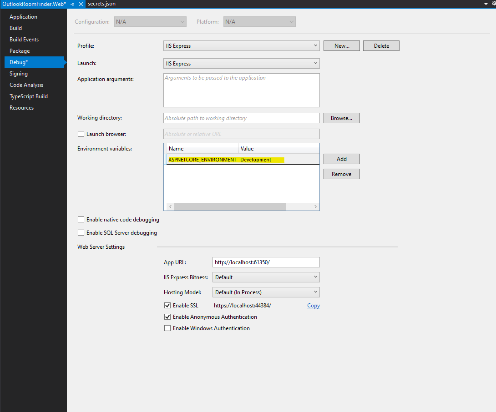

# RoomFinder
Cincinnati Conference Room Scheduler
# Introduction
The Outlook Room Finder is a solution for discovering and aligning rooms/resources to your team or ad hoc meeting needs. Room Finder is a web-based Add-In that renders within Outlook client and Outlook on the Web (OWA). The design enhances existing Office 365 capabilities. Within the Outlook client, it enables the end-user to schedule rooms using the strengths of Exchange Online and Outlook. The application augments the Outlook client or OWA to read calendar dates, meeting schedule(s) (one-time or recurring) and retrieve information from Exchange Online.

When an office or region wants to enable the Room Finder, their Office 365 Group can be associated with the Add-In. Only users within the Group(s) will see the Outlook Add-In. It leverages Exchange Online, Azure Active Directory (AD), and the Graph API to present Office 365 data within an application (Outlook) to which the user is accustomed. No data is stored within the application.

**This solution must be customized to the environment and is not supported by Premier - DO NOT SHARE source code without a MCS Engagement**

## Getting Started
This project requires installation of back-end components. Please refer to the technical documentation for details.

Prerequisites: 
1. Office 365 specifically: (Exchange Online, Outlook [Office])
2. Azure App Service or Web Server (IIS) for hosting the Office Add-in.   Windows or Linux
3. (OPTIONAL) Active Directory (LDAP) accessible the web server, containing all room and equipment resources
4. IMPORTANT: for Exchange Online (Office 365), mailboxes must be in sync between local JSON file (```\DotNet\src\OutlookRoomFinder.Web\wwwroot\assets\config\resources-objects.epaproduction.json```) and Office 365.   The primary fields are userPrincipalName and primarySmtpAddress.

## Documentation

[**Technical Documentation**](https://teams.microsoft.com/l/file/57695838-F86D-4FE3-9751-EE72DA6F7770?tenantId=88b378b3-6748-4867-acf9-76aacbeca6a7&fileType=docx&objectUrl=https%3A%2F%2Fusepa.sharepoint.com%2Fsites%2FRoomFinderProjectManagement%2FShared%20Documents%2FGeneral%2FOne%20Pager%20-%20Room%20Finder%20-%20Technical.docx&baseUrl=https%3A%2F%2Fusepa.sharepoint.com%2Fsites%2FRoomFinderProjectManagement&serviceName=teams&threadId=19:f3167528b5804f5992ed013fa7af7bd0@thread.skype&groupId=2e563845-153a-4d88-9175-496de7303aa3) 
- Provides a comprehensive overview, installation and configuration guide of the solution. 

## Source Code
You must install the following software to modify and maintain the solution.  Once you install the software you can then clone the repository and start building.  Before you begin, please read through the Developement Guidance.

- Visual Studio 2019
    - ASP.NET and web dev
    - .NET Core cross-platform development  
- Visual Studio Code 
    - Extension: Beautify (HookyQR)
    - Extension: C# (Microsoft)
    - Extension: Debugger for Chrome (Microsoft)
    - Extension: Manage User Secrets (reptarsrage)
    - Extension: PowerShell (Microsoft)
    - Extension: TSLint (Microsoft)
- NodeJs 12.16.x or 10.16.x LTS
- GIT

## Add-In Side Loading
Add-In is deployed using a [**Manifest File**]("https://docs.microsoft.com/en-us/office/dev/add-ins/outlook/manifests"). 
Withing the Repository: ```\PowerShell\posh\roomfinder\Scripting\assets\manifest```
- [*Side Load Outlook Add In For Testing*]("https://docs.microsoft.com/en-us/office/dev/add-ins/outlook/sideload-outlook-add-ins-for-testing")
- [*Exchange | Outlook Web Application (side load the app)*](https://outlook.office.com/owa/?path=/options/manageapps)

## Development Guidance

There are 2 aspects of this solution.  
- The backend code which is written in C# and controlled by the web project ```OutlookRoomFinder.Web```.  
- The frontend code is written in Angular and controlled by the VS Code projects ```Angular```

### Overview

The Angular project includes a number of NPM Tasks.   These tasks as outlined below are to assist in the ease of compilation, build, debug, and packaging.

1. ``` npm run start ``` Builds and runs the solution
2. ``` npm run start:ie ``` Builds and runs the solution in the IE Mode
3. ``` npm run start:outlookaddin ``` Builds and runs the Outlook Add In Project
4. ``` npm run start:reporting ``` Builds and runs the Reporting Project
5. ``` npm run build ``` Builds the application
6. ``` npm run build:w ``` Builds the application in IE Mode and Watches the folder for changes
7. ``` npm run build:w:reporting ``` Builds the Reporting application and Watches the folder for changes
8. ``` npm run build:prod ``` Builds the application for Production Deployment
9.  ``` npm run build:outlookaddin ``` Builds the Outlook Add In for Production Deployment
10. ``` npm run build:reporting ``` Builds the Reporting project for Production Deployment
11. ``` npm run test ``` Runs the Application for Testing (Unit Test files)
12. ``` npm run test:watch ``` Runs the Application for Testing (Unit Test files) in Watch Mode
13. ``` npm run test:ci ``` Runs the Application for Testing (Unit Test files) with a Code Coverage Report and Continuous Integration
14. ``` npm run test:coverage ``` Runs the Application for Testing (Unit Test files) with a Code Coverage Report
15. ``` npm run lint ``` Runs the tslint and prints out linting errors
16. ``` npm run e2e ``` Runs the application with Jasmine and Protocol
17. ``` npm run e2e:outlookaddin ``` Runs the Outlook Add In with Jasmine and Protocol
18. ``` npm run e2e:reporting ``` Runs the Reporting application with Jasmine and Protocol
19. ``` npm run e2e:Debug ``` Runs the application in test mode with Jasmine and Protocol
20. ``` npm run e2e:dotnet ```Runs the application in VS Code Only


### Getting Started

EPA Room Finder Developer Guide - Getting Started
1. Download and Install [**NodeJS**](https://nodejs.org/en/download/)
- Verify NodeJS is installed: ``` node -v ```
- Verify NPM is installed: ``` npm -v ```
- Ensure the latest version of NPM is installed: ``` npm install npm@latest -g ```
2. Clone repository from [**Enhanced Room Outlook Addin**](https://dev.azure.com/msft-epa/EnhancedRoomOutlookAddIn)
- git clone https://dev.azure.com/msft-epa/EnhancedRoomOutlookAddIn
3. Open the Angular folder within VS Code
4. From the Terminal, enter: ``` npm install ``` to install all missing packages. 
5. From the Terminal, enter: ``` npm run build ``` to compile/build the [Outlook AddIn] solution
6. From the Terminal, enter: ``` npm run build:reporting ``` to compile/build the [Reporting] solution
7. Open the OutlookRoomFinderCore.sln file with Visual Studio 2019
8. NOTE: Missing Packages will automatically be installed
9. Build the OutlookRoomFinderCore.sln
10. Right-click on OutlookRoomFinder.Web and "Set as Startup Project"
11. Right-click on OutlookRoomFinder.Web and choose "Manage user secrets"
12. Update the User Secrets file.  Download the zip [**Located Here**](https://usepa.sharepoint.com/sites/RoomFinderProjectManagement/Shared%20Documents/General/aspnet-Microsoft.Services.OutlookRoomFinderReports-eb6f5dd0-a072-4694-a281-77cae843c6cd.zip) and replace the contents on your machine.


### Debug Option 1 (combination of VS Code and Visual Studio)

This option is intended to run the code as if it were in production.  The following configuration is required to ensure the application runs inside the web application.  Open the web project and navigate to Debug.  Ensure that "Development" is not the value.


Within Visual Studio Code, using the Angular project: 
1. ``` npm run build:outlookaddin ``` Builds the Outlook Add In for Production Deployment
2. ``` npm run build:reporting ``` Builds the Reporting project for Production Deployment

Within Visual Studio, using OutlookRoomFinder.Web
Select F5 to Debug
Use the local IIS SSL Address (located in the taskbar) (https://localhost:44384) to launch in Chrome, Edge, or Firefox


### Debug Option 2 (only VS Code)

This option is intended to run the code as if it were in production.  The following configuration is required to ensure the application runs inside the web application.  Open the web project and navigate to Debug.  Ensure that "Development" is not the value.


Within Visual Studio Code, navigate to the Angular project directory.  Use Visual Studio Code to update the configuration per the screenshot.   Open the terminal in VS Code.  We recommend opening multiple split screens in the terminal.  


1. ``` npm run build:outlookaddin ``` Builds the Outlook Add In for Production Deployment
2. ``` npm run build:reporting ``` Builds the Reporting project for Production Deployment
3. ``` npm run e2e:dotnet ``` Runs the application in VS Code Only

Use the local IIS SSL Address (located in the VS Code terminal) (https://localhost:44384) to launch in Chrome, Edge, or Firefox

### Debug Option 3 (only VS Code - with constant file monitoring)

This option is intended to run the code as if it were in production.  However, this configuration enables you to change a line of code or stylesheet markup and it will auto recompile.  The following configuration is required to ensure the application runs inside the web application.  Open the web project and navigate to Debug.  Ensure that "Development" is not the value.


Within Visual Studio Code, navigate to the Angular project directory.  Use Visual Studio Code to update the configuration per the screenshot.   Open the terminal in VS Code.  We recommend opening multiple split screens in the terminal.  


1. ``` npm run build:w ``` Builds the application in IE Mode and Watches the folder for changes
2. ``` npm run build:w:reporting ``` Builds the Reporting application and Watches the folder for changes
3. ``` npm run e2e:dotnet ``` Runs the application in VS Code Only

Use the local IIS SSL Address (located in the VS Code terminal) (https://localhost:44384) to launch in Chrome, Edge, or Firefox


### Debug Option 4 (only VS Code - with proxy to angulars' NG Serve)

This option is intended to run the code using NG SERVE.  Also referred to as proxy development using @angular/cli.  This configuration enables you to change a line of code or stylesheet markup and it will auto recompile.  The following configuration is required to ensure the application runs inside the web application.  Open the web project and navigate to Debug.  Ensure that "Development" is the value.



Within Visual Studio Code, navigate to the Angular project directory.  Use Visual Studio Code to update the configuration per the screenshot.   Open the terminal in VS Code.  We recommend opening multiple split screens in the terminal.  


1. ``` npm run start:outlookaddin ``` Builds and serves the Outlook Add In Project
2. ``` npm run start:reporting ``` Builds and serves the Reporting Project
3. ``` npm run e2e:dotnet ``` Runs the application in VS Code Only

Use the local IIS SSL Address (located in the VS Code terminal) (https://localhost:44384) to launch in Chrome, Edge, or Firefox


## Deployment and build instructions
Builds for Production are generated through Azure DevOps. 
Pull Requests are required to submit changes.
Once Pull Requests are approved, the project will build and publish the solution
The published solution can be downloaded as a ZIP file from the Pipelines->(Latest Pipeline)->Summary->Related-Publ
